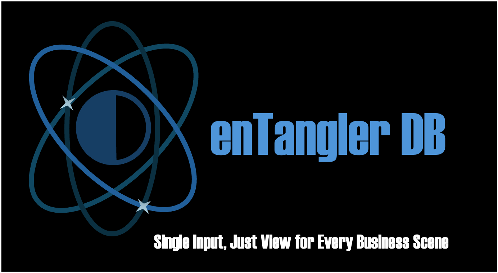

# enTangler DB: A Next-Generation Database to Accelerate Business Evolution

The business world is in a state of constant flux, and data serves as a mirror reflecting these changes. However, traditional databases can sometimes cloud this mirror. Do you find yourself struggling to locate the information you need or to adapt to changes?

enTangler DB is a brand-new database designed to address these challenges.

## Seamlessly Connecting Data and Business

enTangler DB liberates data from rigid formats. It allows you to freely combine data in the form you need, when you need it, and to flexibly reshape it in response to business changes. Like a versatile tool that adapts to the dynamics of your business, it empowers you to maximize the value of your data.

## Transforming Data into Value, from Past to Future

Past data is a valuable compass for the future. However, in traditional databases, past data often lies dormant. enTangler DB enables you to analyze past data from a present perspective, allowing you to learn from past successes and failures to shape future strategies.

## Accelerating Business Velocity

enTangler DB accelerates business decision-making. By providing the right information in the right format at the right time, it enables swift and accurate decisions.

## Further Evolution through Technological Innovation and AI

enTangler DB continues to evolve through its integration with AI technology. Natural language processing and advanced analytical capabilities unlock limitless possibilities for data utilization.

enTangler DB is a powerful partner that accelerates business evolution.

Harness the true value of your data and pave the way for the future of your business with enTangler DB.

---

# Technical Concept

## How enTangler DB Manages Business Data

Traditionally, business data is structured in standardized formats such as tables and graphs. While these formats offer a general overview, they often fall short of providing the precise data required for specific tasks.

Many data-oriented systems attempt to address this issue by developing complex user interfaces layered on top of tables and relational databases. However, transforming data into these user interfaces often comes at a cost in terms of development complexity and potential performance issues.

Furthermore, as business models evolve, the user interfaces must adapt accordingly, while the underlying data often remains in its original form. This creates a growing disconnect between the business model and the data structure, leading to additional costs and technical challenges.

enTangler DB stores data as independent variables, free from any predefined structure. It provides a mechanism to dynamically define variable sets and relationships, called "Sheets," which serve as the core data unit in enTangler DB.

Business users have the flexibility to define and modify any number of Sheets according to their specific needs. This ensures that the business model, user interface, and data remain aligned, eliminating unnecessary costs and performance penalties.

## enTangler DB's Timeline Awareness

Most business data reflects the latest status, which is undoubtedly crucial for the majority of business scenarios. However, there are instances where access to historical data is critical, such as reviewing customer communication history when preparing proposals or investigating the root cause of current business issues.

In such cases, many systems offer "change history" functionality, allowing users to track modifications made to specific data sets in the past.

enTangler DB takes this concept further by enabling users to retrieve any stored data from any point in the past. Moreover, it supports standard CRUD (Create, Read, Update, Delete) operations on past data, viewed through the lens of current Sheet definitions, even if those Sheets and relationships didn't exist at the time.

With enTangler DB, business users can not only look back at their business history but also analyze past data using their current business schema, providing valuable insights and facilitating informed decision-making.

## Secure and Advanced Integration with AI

Generative AI has been rapidly developing its capabilities since its emergence. However, some unresolved issues are hindering its widespread adoption as a core business tool. One of the most critical concerns is safeguarding sensitive business data.

Business data often contains confidential and private information, protected through authentication and authorization processes. Authorization, in particular, is vital for controlling access to data based on individual user privileges. However, once data is acquired by generative AI, these authorization controls disappear, potentially leading to the exposure and misuse of sensitive data in response to any query.

enTanglerDB addresses this issue by providing a secure data gateway interface for Retrieval Augmented Generation (RAG). This interface ensures that even when generative AI accesses data, the original security and privacy controls remain in effect.

#### User Authentication and Authorization Integration:

enTanglerDB enforces access control based on user authentication and authorization credentials for each data request from the generative AI. This prevents unauthorized users from accessing sensitive data.

#### Data Masking and Anonymization:

Prior to providing sensitive or personal data to the generative AI, enTanglerDB applies data masking and anonymization techniques to safeguard privacy.

#### Audit Logs:

enTanglerDB maintains comprehensive audit logs of all data access and operations performed by the generative AI, enabling tracking and auditing as needed.

#### Real-time Data Updates:

Changes in the database are reflected in real-time within the generative AI, ensuring that responses are always generated based on the most up-to-date information.

Through these features, enTanglerDB enables businesses to leverage the power of generative AI while ensuring the security of their business data, fostering a safe and reliable environment for AI adoption.
